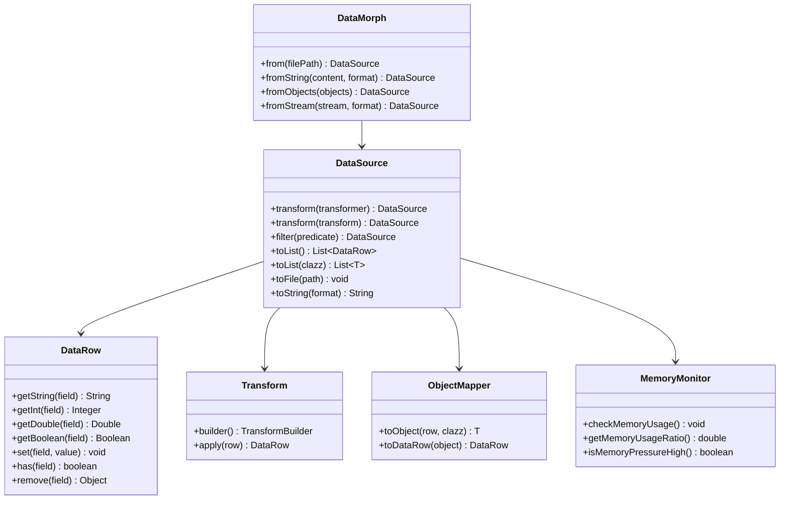

# DataMorph

<p align="center">
  
  
  
</p>

## 🚀 Overview

**DataMorph**는 다양한 데이터 소스(CSV, JSON)를 파싱하고 변환하는 Java 라이브러리입니다. 직관적인 Fluent API를 통해 데이터 변환 작업을 체이닝할 수 있으며, 메모리 효율적인 스트리밍 처리를 지원합니다.

### ✨ Key Features

- **🔄 Fluent API**: 직관적인 메서드 체이닝을 통한 데이터 변환
- **📊 Multiple Data Sources**: 파일, 문자열, 객체 리스트, 스트림 지원
- **🚀 Streaming Processing**: 대용량 데이터를 위한 메모리 효율적 처리
- **🔧 POJO Mapping**: 리플렉션 기반 양방향 객체 변환
- **📈 Memory Monitoring**: JMX 기반 실시간 메모리 사용량 추적
- **🎯 Zero Dependencies**: 순수 Java 구현으로 가벼운 용량

### 🎯 Why DataMorph?

| DataMorph | vs. 기존 방식 |
|-----------|-------------|
| 통합된 단일 API | 여러 라이브러리 조합 필요 |
| Zero Dependencies | Multi Dependencies |
| 즉시 사용 가능 | 복잡한 설정 |
| 스트리밍 처리 | 메모리 부족 위험 |

## 📦 Installation

### Gradle (Kotlin DSL)
```kotlin
repositories {
    mavenCentral()
    maven { url = uri("https://jitpack.io") }
}

dependencies {
    implementation("com.github.HwangInUng:data-morph:1.0.0")
}
```

### Gradle (Groovy)
```groovy
repositories {
    mavenCentral()
    maven { url 'https://jitpack.io' }
}

dependencies {
    implementation 'com.github.HwangInUng:data-morph:1.0.0'
}
```

### Maven
```xml
<repositories>
    <repository>
        <id>jitpack.io</id>
        <url>https://jitpack.io</url>
    </repository>
</repositories>

<dependencies>
    <dependency>
        <groupId>com.github.HwangInUng</groupId>
        <artifactId>data-morph</artifactId>
        <version>1.0.0</version>
    </dependency>
</dependencies>
```

[](https://jitpack.io/#HwangInUng/data-morph)

## 🚀 Quick Start

### 기본 파일 처리

```java
// CSV 파일 읽기 및 변환
DataSource dataSource = DataMorph.from("employees.csv");

List<DataRow> results = dataSource
    .filter(row -> row.getInt("age") > 30)
    .transform(row -> {
        Integer salary = row.getInt("salary");
        if (salary != null) {
            row.set("salary", (int)(salary * 1.1)); // 10% 인상
        }
    })
    .toList();

// 결과를 파일로 저장
dataSource.toFile("processed_employees.csv");
```

### 문자열 처리

```java
// JSON 문자열 파싱
String jsonData = "[{\"name\":\"John\",\"age\":30},{\"name\":\"Jane\",\"age\":25}]";
DataSource dataSource = DataMorph.fromString(jsonData, Format.JSON);

List<DataRow> adults = dataSource
    .filter(row -> row.getInt("age") >= 18)
    .toList();
```

### 객체 리스트 처리

```java
// POJO 객체 리스트 변환
List<Employee> employees = Arrays.asList(
    new Employee("John", 30, 50000),
    new Employee("Jane", 25, 45000)
);

DataSource dataSource = DataMorph.fromObjects(employees);
List<Employee> processedEmployees = dataSource
    .transform(Transform.builder()
        .rename("emp_name", "name")
        .add("bonus", 1000)
        .build())
    .toList(Employee.class);
```

---

## 📚 API Reference

자세한 API 문서는 [API Reference](docs/API_REFERENCE.md)를 참조하세요.

---

## 🎨 Examples

다양한 사용 예제는 [Examples](docs/EXAMPLES.md)를 참조하세요.

---

## 🏗️ Architecture

### 패키지 구조

```
com.datamorph/
├── core/                    # 핵심 API (DataMorph, DataSource, DataRow)
├── parser/                  # 파일 파싱 엔진 (CSV, JSON)
├── writer/                  # 파일 출력 엔진 (CSV, JSON)
├── transform/               # 데이터 변환 엔진
├── mapper/                  # POJO 매핑 엔진
├── streaming/               # 스트리밍 처리 및 메모리 관리
├── util/                    # 유틸리티 (포맷 감지)
└── exceptions/              # 예외 처리
```

### 클래스 다이어그램



---

## 🔧 Advanced Features

### 스트리밍 처리

```java
// 대용량 파일 처리 (메모리 효율적)
DataSource largeDataSource = DataMorph.fromStreamFile("large_data.csv");

List<DataRow> results = largeDataSource
    .filter(row -> row.getInt("score") > 80)
    .transform(row -> row.set("grade", "A"))
    .toList();
```

### 메모리 모니터링

```java
MemoryMonitor monitor = new MemoryMonitor();

// 메모리 사용량 확인
monitor.checkMemoryUsage();

// 메모리 정보 출력
System.out.println(monitor.getMemoryInfo());
```

### 파일 포맷 변환

```java
// CSV를 JSON으로 변환
DataMorph.convertFile("input.csv", "output.json");

// 특정 포맷 지정
DataMorph.convertFile("data.txt", "result.txt", Format.CSV, Format.JSON);
```

---

## 📊 Performance

### 메모리 효율성

- **스트리밍 처리**: 대용량 파일도 일정한 메모리 사용량으로 처리
- **지연 평가**: 필요한 시점에만 데이터 로드
- **메모리 모니터링**: 실시간 메모리 사용량 추적 및 경고

### 성능 벤치마크

*성능 평가는 현재 진행 중입니다. 다음 업데이트에서 구체적인 벤치마크 결과를 제공할 예정입니다.*

#### 계획된 성능 지표
- **처리 속도**: 파일 크기별 처리 시간
- **메모리 사용량**: 일반 처리 vs 스트리밍 처리 비교
- **처리량**: 초당 처리 가능한 레코드 수
- **확장성**: 다양한 데이터 크기에서의 성능 변화

#### 예상 성능 특성
| 파일 크기 | 예상 처리 시간 | 메모리 사용량 | 처리 방식 |
|-----------|---------------|---------------|-----------|
| ~10MB     | 1-2초         | 적음          | 일반 처리 |
| ~100MB    | 5-10초        | 중간          | 스트리밍 권장 |
| ~1GB+     | 30-60초       | 일정          | 스트리밍 필수 |

### 지원 포맷

| 포맷 | 읽기 | 쓰기 | 스트리밍 |
|------|------|------|----------|
| CSV  | ✅   | ✅   | ✅       |
| JSON | ✅   | ✅   | ✅       |

## 🧪 Testing

```bash
# 전체 테스트 실행
./gradlew test

# 특정 테스트 실행
./gradlew test --tests "DataMorphTest"

# 통합 테스트
./gradlew test --tests "com.datamorph.integration.*"
```

## 🤝 Contributing

1. Fork the repository
2. Create a feature branch (`git checkout -b feature/amazing-feature`)
3. Commit your changes (`git commit -m 'Add some amazing feature'`)
4. Push to the branch (`git push origin feature/amazing-feature`)
5. Open a Pull Request

## 📄 License

This project is licensed under the MIT License - see the [LICENSE](LICENSE) file for details.

## 🔗 Links

- [API Documentation](docs/API_REFERENCE.md)
- [Examples](docs/EXAMPLES.md)
- [Contributing Guide](CONTRIBUTING.md)
- [Changelog](CHANGELOG.md)

---

<p align="center">
Made with ❤️ by DataMorph Contributors
</p>
