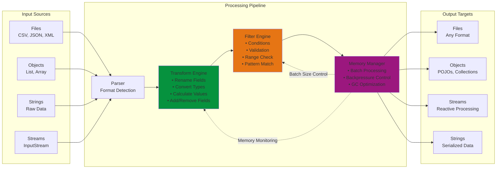
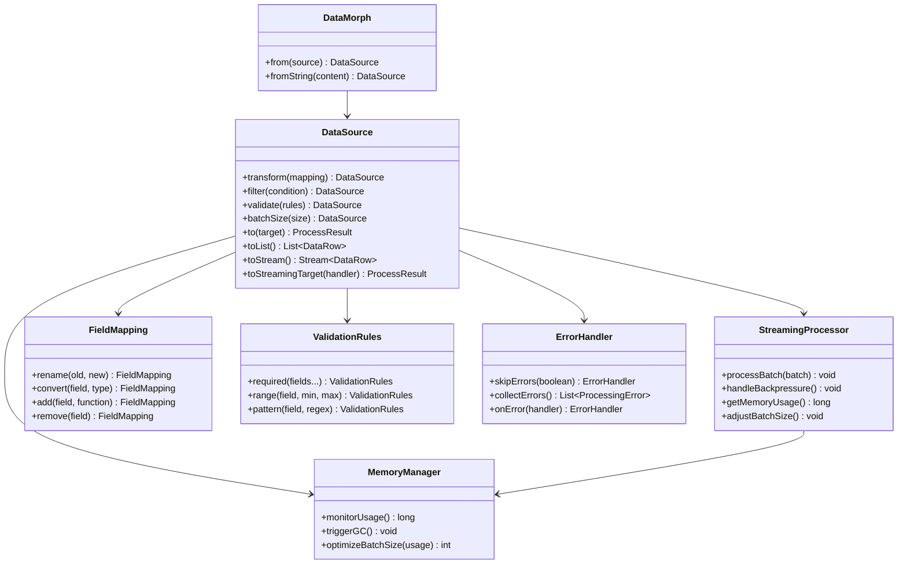

# data-morph
## 🚀 Overview
> DataMorph는 다양한 데이터 소스와 타겟 간의 자유로운 변환을 지원하는 경량 Java 라이브러리입니다. 직관적인 Fluent API로 파일, 객체, 메모리 데이터를 원하는 형태로 효율적으로 변환할 수 있습니다.

### Key Features
- Flexible I/O : File <-> File, Object <-> File, Memory Processing 지원
- Fluent API : 직관적인 메서드 체이닝으로 읽기 쉬운 코드
- High Performance : 대용량 파일 스트리밍 처리 및 메모리 최적화
- Zero Dependencies : 순수 Java 구현으로 가벼운 용량
- Configuration-Driven : YAML 등 설정 파일 지원

### Why DataMorph?
|DataMorph|vs. Jackson + Commons CSV|
|---|---|
|통합된 단일 API|여러 라이브러리 조합 필요|
|Zero Dependencies|Multi Dependencies|
|즉시 사용 가능|복잡한 설정|

### Data Flow Architecture


### Core Components


### Package Structure
```bash
com.datamorph/
├── core/                           # 핵심 API 및 데이터 모델
├── parser/                         # 파일 파싱 엔진
├── transform/                      # 데이터 변환 엔진
├── writer/                         # 파일 출력 엔진
├── streaming/                      # 대용량 처리 및 최적화
├── config/                         # 설정 관리
├── error/                          # 예외 처리
└── util/                           # 유틸리티
```

## 💻 Installation (Maven/Gradle Dependency)
### Maven
```xml
<dependency>
    <groupId>com.example</groupId>
    <artifactId>datamorph</artifactId>
    <version>1.0.0</version>
</dependency>
```

### Gradle
```gradle
implementation 'com.example:datamorph:1.0.0'
```

## ⚡️ Quick Start - (작업 중)
### Basic File Conversion
### Memory Processing

## 📄 Documentation - (작업 중)
자세한 API 사용법, 강화된 기능과 설정 옵션들은 다음 문서들을 참고하세요.
- API Reference Guide - 전체 메서드 문서화 및 예제
- Configuration Guide - YAML 등 설정 및 고급 옵션
- Performance Tuning - 대용량 파일 처리 및 최적화
- Example - 실제 사용 사례 및 샘플

## ⚙️ Configuration - (작업 중)
### YMAL Configuration
### Properties Configuration
### Using COnfiguration

## 🎯 Performance Benchmarks - (작업 중)
### Processing Performance
|File Size|Records|Processing Time|Memory Usage|Throughput|
|---|---|---|---|---|
|10MB|||||
|100MB|||||
|1GB|||||

### Memory Efficiency
|Operation Type|File Size|Peak Memory|Average Memory|Memory Growth|
|---|---|---|---|---|
|Simple Transform|||||
|Complex Transform|||||
|Streaming Process|||||
|Batch Process|||||

### Feature Performance
|Feature|Samll Files(<10MB)|Large Files(1GB+)|Notes|
|---|---|---|---|
|CSV Parsing||||
|JSON Generation||||
|Field Transformation||||
|Data Validation||||
|Error Recovery||||

### Streaming vs Non-Streaming
|File Size|Non-Streaming Memory|Streaming Memory|Memory Reduction|
|---|---|---|---|
|100MB||||
|1GB||||
|5GB||||

## 라이선스 표기 - (작업 중)
