# data-morph
## 🚀 Overview
> DataMorph는 다양한 데이터 소스와 타겟 간의 자유로운 변환을 지원하는 경량 Java 라이브러리입니다. 직관적인 Fluent API로 파일, 객체, 메모리 데이터를 원하는 형태로 효율적으로 변환할 수 있습니다.

### Key Features
- Flexible I/O : File <-> File, Object <-> File, Memory Processing 지원
- Fluent API : 직관적인 메서드 체이닝으로 읽기 쉬운 코드
- High Performance : 대용량 파일 스트리밍 처리 및 메모리 최적화
- Zero Dependencies : 순수 Java 구현으로 가벼운 용량
- Configuration-Driven : YAML 등 설정 파일 지원

### Why DataMorph?
|DataMorph|vs. Jackson + Commons CSV|
|---|---|
|통합된 단일 API|여러 라이브러리 조합 필요|
|Zero Dependencies|Multi Dependencies|
|즉시 사용 가능|복잡한 설정|

### Data Flow Architecture

```mermaid
flowchart LR
    subgraph "Input Sources"
        A1[Files<br/>CSV, JSON, XML]
        A2[Objects<br/>List, Array]
        A3[Strings<br/>Raw Data]
        A4[Streams<br/>InputStream]
    end
    
    subgraph "Processing Pipeline"
        B1[Parser<br/>Format Detection]
        B2[Transform Engine<br/>• Rename Fields<br/>• Convert Types<br/>• Calculate Values<br/>• Add/Remove Fields]
        B3[Filter Engine<br/>• Conditions<br/>• Validation<br/>• Range Check<br/>• Pattern Match]
        B4[Memory Manager<br/>• Batch Processing<br/>• Backpressure Control<br/>• GC Optimization]
    end
    
    subgraph "Output Targets"
        C1[Files<br/>Any Format]
        C2[Objects<br/>POJOs, Collections]
        C3[Streams<br/>Reactive Processing]
        C4[Strings<br/>Serialized Data]
    end
    
    A1 --> B1
    A2 --> B1
    A3 --> B1
    A4 --> B1
    
    B1 --> B2
    B2 --> B3
    B3 --> B4
    
    B4 --> C1
    B4 --> C2
    B4 --> C3
    B4 --> C4
    
    B4 -.->|"Memory Monitoring"| B2
    B4 -.->|"Batch Size Control"| B3
    
    style B2 fill:#06923E
    style B3 fill:#E67514
    style B4 fill:#9B177E
```


### Core Components


### Package Structure
```bash
com.datamorph/
├── core/                           # 핵심 API 및 데이터 모델
├── parser/                         # 파일 파싱 엔진
├── transform/                      # 데이터 변환 엔진
├── writer/                         # 파일 출력 엔진
├── streaming/                      # 대용량 처리 및 최적화
├── Config/                         # 설정 관리
├── error/                          # 예외 처리
└── util/                           # 유틸리티
```
---

## 💻 Contents
### ⚡️ Quick Start - (작업 중)
#### Maven
```xml
<dependency>
    <groupId>com.example</groupId>
    <artifactId>datamorph</artifactId>
    <version>1.0.0</version>
</dependency>
```

#### Gradle
```gradle
implementation 'com.example:datamorph:1.0.0'
```

#### Basic File Processing
```java
// file data read
DataSource dataSource = DataMorph.from("employees.csv");

// filter & transform
List<DataRow> results = dataSource
    .filter(row -> {
        Integer age = row.getInt("age");
        return age != null && age >= 30;
    })
    .transform(row -> {
        Integer salary = row.getInt("salary");
        if (salary != null) {
            int bonusSalary = (int)(salary * 1.1);
            row.set("salary", bonusSalary);
        }
    })
    .toList();
```

#### String Content Processing
```java
// JSON data read
String jsonData = "[{\"name\":\"John\",\"age\":30}]";
DataSource dataSource = DataMorph.fromString(jsonData, Format.JSON);

// data process
List<DataRow> results = dataSource.toList();
```

#### CSV File Example
```java
// CSV: name,age,department
// John,30,Engineering
// Jane,25,Marketing

DataSource employees = DataMorph.from("employees.csv");

List<DataRow> seniorEngineers = employees
    .filter(row -> "Engineering".equals(row.getString("department")))
    .filter(row -> row.getInt("age") > 30)
    .toList();
```

### 📚 API Examples

#### 파일 처리
```java
// CSV file read
DataSource csvData = DataMorph.from("data.csv");

// JSON file read 
DataSource jsonData = DataMorph.from("data.json");

// auto formatting
DataSource autoData = DataMorph.from("unknown.csv");
```

#### 문자열 처리
```java
// CSV parsing
String csvContent = "name,age\nJohn,30\nJane,25";
DataSource csvData = DataMorph.fromString(csvContent, Format.CSV);

// JSON parsing
String jsonContent = "[{\"name\":\"John\",\"age\":30}]";
DataSource jsonData = DataMorph.fromString(jsonContent, Format.JSON);
```

#### 데이터 변환
```java
DataSource transformed = DataMorph.from("employees.csv")
    .transform(row -> {
        Integer age = row.getInt("age");
        if (age != null) {
            String ageGroup = age < 30 ? "젊은층" : age < 50 ? "중년층" : "장년층";
            row.set("age_group", ageGroup);
        }
    })
    .transform(row -> row.set("salary", (int)(salary * 1.05)));
```

#### 데이터 필터링
```java
DataSource filtered = DataMorph.from("sales.csv")
    .filter(row -> row.isOverCount())
    .filter(row -> "서울".equals(row.getString("region")));
```

#### 체인 방식 처리
```java
List<DataRow> result = DataMorph.from("customers.csv")
    .filter(row -> "VIP".equals(row.getString("grade")))
    .transform(row -> row.set("discount", "20%"))
    .filter(row -> "Active".equals(row.getString("status")))
    .toList();
```

#### 에러 처리
```java
try {
    DataSource data = DataMorph.from("data.csv");
    List<DataRow> results = data.toList();
} catch (IllegalArgumentException e) {
    // 파일 관련 오류 (존재하지 않음, 잘못된 경로 등)
    System.err.println("파일 오류: " + e.getMessage());
} catch (ParseException e) {
    // 파싱 오류 (잘못된 형식, 지원하지 않는 포맷 등)
    System.err.println("파싱 오류: " + e.getMessage());
}
```

### 📄 Documentation - (작업 중)
자세한 API 사용법, 강화된 기능과 설정 옵션들은 다음 문서들을 참고하세요.
- [API Reference Guide]() - 전체 메서드 문서화 및 예제
- [Configuration Guide]() - YAML 등 설정 및 고급 옵션
- [Performance Tuning]() - 대용량 파일 처리 및 최적화
- [Example]() - 실제 사용 사례 및 샘플

### ⚙️ Configuration - (작업 중)
#### YAML Configuration
#### Properties Configuration
#### Using Configuration

### 🎯 Performance Benchmarks - (작업 중)
#### Processing Performance
|File Size|Records|Processing Time|Memory Usage|Throughput|
|---|---|---|---|---|
|10MB|||||
|100MB|||||
|1GB|||||

#### Memory Efficiency
|Operation Type|File Size|Peak Memory|Average Memory|Memory Growth|
|---|---|---|---|---|
|Simple Transform|||||
|Complex Transform|||||
|Streaming Process|||||
|Batch Process|||||

#### Feature Performance
|Feature|Small Files(<10MB)|Large Files(1GB+)|Notes|
|---|---|---|---|
|CSV Parsing||||
|JSON Generation||||
|Field Transformation||||
|Data Validation||||
|Error Recovery||||

#### Streaming vs Non-Streaming
|File Size|Non-Streaming Memory|Streaming Memory|Memory Reduction|
|---|---|---|---|
|100MB||||
|1GB||||
|5GB||||

---

## 🪪 라이선스 표기 - (작업 중)
